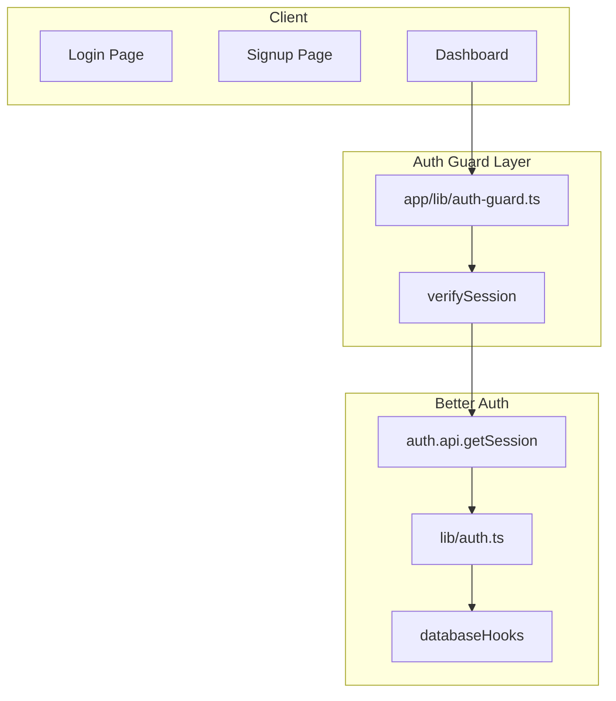
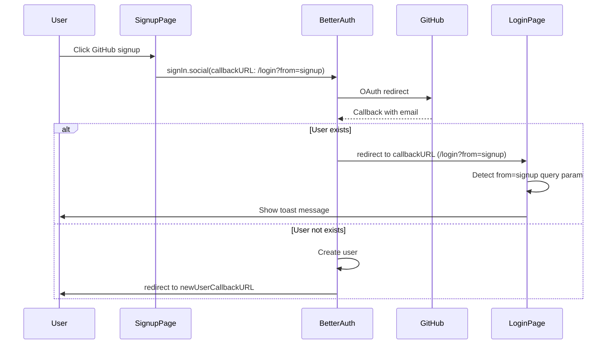
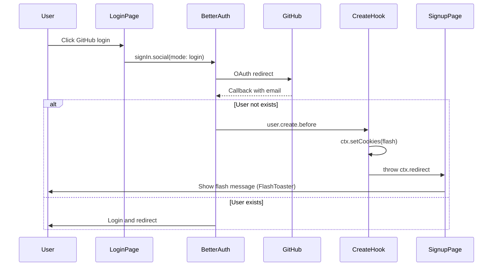
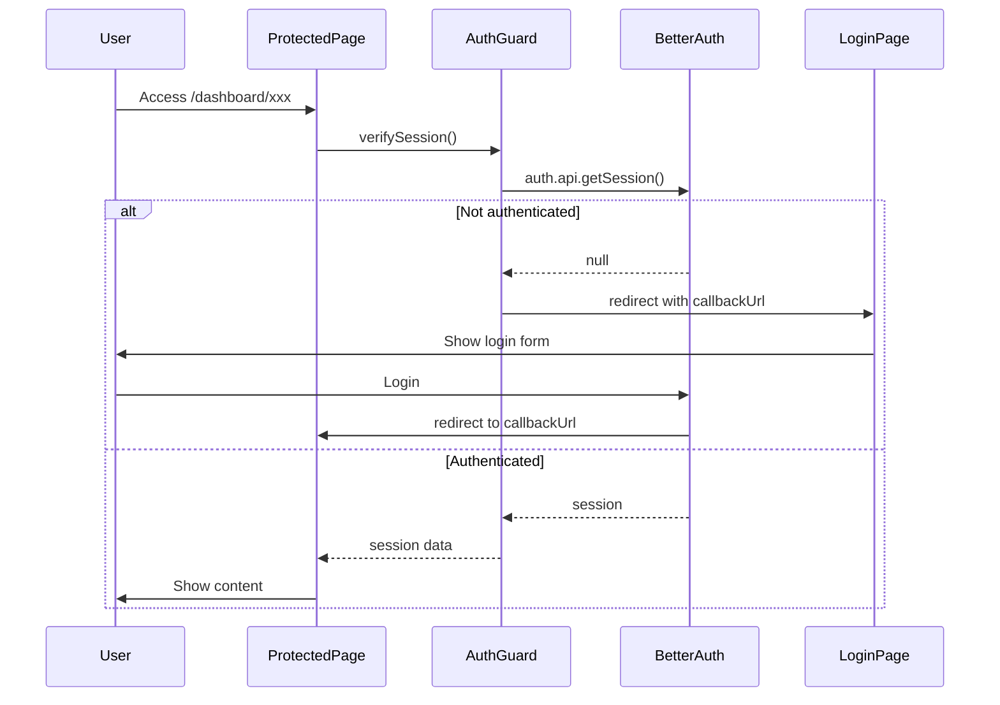

# Design Document: fix-auth-hook

## Overview

**Purpose**: 認証フロー全体の動作を改善し、ユーザー体験を向上させる。ルートエンドポイントでの自動リダイレクト、新規登録/ログイン画面での重複アカウント・未登録アカウント検出、および保護ルートへの未認証アクセス時のリダイレクト＆コールバック機能を提供する。

**Users**: 全ユーザー（認証済み・未認証）が対象。ログイン・新規登録・ダッシュボードアクセスのフローで利用。

**Impact**: 既存の Better Auth 設定に hooks を追加し、Auth Guard パターンで認証検証を実装。既存のレイアウトファイルでの個別セッションチェックは Auth Guard に統合。

### Goals
- 認証状態に応じたルートエンドポイントの自動リダイレクト
- GitHub OAuth でのユーザー存在チェックとフラッシュメッセージ表示
- 保護ルートへの未認証アクセス時のログインリダイレクト＆コールバック
- 既存の Magic Link ユーザー存在チェック機能の維持

### Non-Goals
- Magic Link のユーザー存在チェック改修（既に実装済み）
- アカウントリンク機能の有効化
- メール送信機能（Resend 統合は別 Phase）

## Architecture

### Existing Architecture Analysis

現在の認証アーキテクチャ:
- **Better Auth** (`lib/auth.ts`): GitHub OAuth + Magic Link 設定済み
- **セッションチェック**: 各レイアウトファイル（dashboard/setting）で個別実装
- **フラッシュメッセージ**: `lib/flash-toaster.tsx` で Cookie ベース実装

新規追加:
- **Auth Guard**: `app/lib/auth-guard.ts` でセッション検証を一元化（Next.js / Better Auth 推奨パターン）

### Architecture Pattern & Boundary Map



**Architecture Integration**:
- Selected pattern: Auth Guard + Better Auth Hooks（Next.js / Better Auth 推奨パターン）
- Domain boundaries: 認証検証は Auth Guard 層、OAuth フックは Better Auth hooks
- Existing patterns preserved: Effect-TS サービスパターン
- New components rationale: Auth Guard はデータソース近くでの認証検証一元化のため（セキュリティベストプラクティス）
- Steering compliance: TypeScript strict mode、Effect-TS サービスパターン準拠
- Reference: [Next.js Authentication Guide](https://nextjs.org/docs/app/guides/authentication), [Better Auth Next.js Integration](https://www.better-auth.com/docs/integrations/next)

### Technology Stack

| Layer | Choice / Version | Role in Feature | Notes |
|-------|------------------|-----------------|-------|
| Auth Guard | React cache + Better Auth | セッション検証、リダイレクト | Next.js 推奨パターン |
| Auth | Better Auth | OAuth hooks、セッション管理 | databaseHooks API 使用 |
| Flash | Cookie + Sonner + Query Param | フラッシュメッセージ表示 | 既存実装 + LoginPageFlash |

## System Flows

### GitHub OAuth 新規登録フロー（Req 3）



### GitHub OAuth ログインフロー（Req 5）



### 保護ルートアクセスフロー（Req 6）



## Requirements Traceability

| Requirement | Summary | Components | Interfaces | Flows |
|-------------|---------|------------|------------|-------|
| 1.1 | 認証済み→/dashboard | RootPage, AuthGuard | verifySession | - |
| 1.2 | 未認証→/login | RootPage, AuthGuard | verifySession | - |
| 2.1 | 新規登録 Magic Link 既存チェック | (既存実装) | - | - |
| 2.2 | 新規登録 Magic Link 正常フロー | (既存実装) | - | - |
| 3.1 | 新規登録 GitHub 既存チェック | GithubAuthSignupForm, LoginPageFlash | callbackURL | GitHub OAuth 新規登録 |
| 3.2 | 新規登録 GitHub 正常フロー | (Better Auth default) | - | - |
| 4.1 | ログイン Magic Link 未登録チェック | (既存実装) | - | - |
| 4.2 | ログイン Magic Link 正常フロー | (既存実装) | - | - |
| 5.1 | ログイン GitHub 未登録チェック | DatabaseHooks, GithubAuthForm | OAuthState | GitHub OAuth ログイン |
| 5.2 | ログイン GitHub 正常フロー | (Better Auth default) | - | - |
| 6.1 | 未認証アクセス→/login + callback | AuthGuard | verifySession | 保護ルートアクセス |
| 6.2 | ログイン成功→callback URL | (既存実装 useRedirectPath) | - | - |
| 6.3 | ログイン成功→/dashboard | (既存実装 useRedirectPath) | - | - |
| 6.4 | パブリックルート定義 | (不要: AuthGuard は保護ページでのみ呼び出し) | - | - |

## Components and Interfaces

| Component | Domain/Layer | Intent | Req Coverage | Key Dependencies | Contracts |
|-----------|--------------|--------|--------------|------------------|-----------|
| AuthGuard (verifySession) | Auth Guard | セッション検証、未認証リダイレクト | 1.1, 1.2, 6.1 | Better Auth (P0) | Service |
| RootPage | Page | ルートエンドポイントのリダイレクト | 1.1, 1.2 | AuthGuard (P0) | - |
| AuthHooks | Auth | GitHub OAuth ログイン時の未登録ユーザー検出 | 5.1 | ctx.setCookies (P0) | Service |
| GithubAuthForm | UI | ログイン用 GitHub ボタン（mode 追加） | 5.1 | authClient (P0) | - |
| GithubAuthSignupForm | UI | 新規登録用 GitHub ボタン（callbackURL 変更） | 3.1 | authClient (P0) | - |
| LoginPageFlash | UI | ログインページでのクエリパラメータ検知・フラッシュ表示 | 3.1 | useSearchParams (P0) | - |

### Auth Guard Layer

#### AuthGuard (verifySession)

| Field | Detail |
|-------|--------|
| Intent | セッション検証の一元化、未認証時のリダイレクト |
| Requirements | 1.1, 1.2, 6.1 |

**Responsibilities & Constraints**
- Better Auth session API を使用したセッション検証
- 未認証時の /login リダイレクト（callbackUrl 付与）
- React `cache()` によるリクエスト内でのメモ化
- Server Component / Server Action からのみ呼び出し可能

**Dependencies**
- Inbound: Server Components, Server Actions (P0)
- External: Better Auth session API (P0)

**Contracts**: Service [x]

##### Service Interface
```typescript
// app/lib/auth-guard.ts
import 'server-only'
import { cache } from 'react'
import { headers } from 'next/headers'
import { redirect } from 'next/navigation'
import { auth } from '@/lib/auth'

export const verifySession = cache(async (options?: { returnTo?: string }) => {
  const session = await auth.api.getSession({
    headers: await headers()
  })

  if (!session) {
    // returnTo: ログイン成功後に戻る先（デフォルトは /dashboard）
    const callbackUrl = options?.returnTo ?? '/dashboard'
    redirect(`/login?callbackUrl=${encodeURIComponent(callbackUrl)}`)
  }

  return session
})

// ルートページ等、認証状態で分岐するがリダイレクト先が異なるケース用
export const getSession = cache(async () => {
  return await auth.api.getSession({
    headers: await headers()
  })
})
```
- Preconditions: Server Component または Server Action から呼び出される
- Postconditions: セッションが存在する場合は session を返却、存在しない場合は /login にリダイレクト
- Invariants: `cache()` により同一リクエスト内で1回のみ実行

**Implementation Notes**
- Integration: 保護ページの先頭で `await verifySession()` を呼び出し
- Validation: Better Auth session API による DB 検証（セキュアな検証）
- Risks: なし（Next.js / Better Auth 推奨パターン）

#### RootPage

| Field | Detail |
|-------|--------|
| Intent | ルートエンドポイント（/）での認証状態に応じたリダイレクト |
| Requirements | 1.1, 1.2 |

**Contracts**: -

##### Implementation
```typescript
// app/page.tsx
import { redirect } from 'next/navigation'
import { getSession } from '@/app/lib/auth-guard'

export default async function RootPage() {
  const session = await getSession()

  if (session) {
    redirect('/dashboard')
  } else {
    redirect('/login')
  }
}
```

### Auth Layer

#### AuthHooks

| Field | Detail |
|-------|--------|
| Intent | GitHub OAuth ログイン時の未登録ユーザー検出・リダイレクト |
| Requirements | 5.1 |

**Responsibilities & Constraints**
- OAuth state から `mode` を取得
- `mode: 'login'` 時: ユーザーが存在しない場合は作成を防止、フラッシュ Cookie 設定後リダイレクト
- `mode: 'signup'` 時: Better Auth の `callbackURL`/`newUserCallbackURL` で処理（hooks 不使用）

**Dependencies**
- Inbound: Better Auth hooks runtime (P0)

**Contracts**: Service [x]

##### Service Interface
```typescript
// lib/auth.ts への追加
import { betterAuth, type BetterAuthOptions } from "better-auth";

interface OAuthStateData {
  mode?: "login" | "signup";
}

// Better Auth hooks の ctx 型（databaseHooks.user.create.before の第2引数）
type HookContext = Parameters<NonNullable<NonNullable<BetterAuthOptions["databaseHooks"]>["user"]>["create"]>["before"]>[1];

// maxAge: 1 で即時削除。リダイレクト先の FlashToaster が読み取り後に破棄される
const setFlashCookie = (ctx: HookContext, flash: { type: string; message: string }) => {
  ctx.setCookies("flash", JSON.stringify(flash), { maxAge: 1 });
};

export const auth = betterAuth({
  // ... existing config

  databaseHooks: {
    user: {
      create: {
        before: async (user, ctx) => {
          // ログイン画面からの OAuth で未登録ユーザーが来た場合、自動登録させず新規登録を促す
          const state = ctx.context.oauth?.state as OAuthStateData | undefined;
          if (state?.mode === "login") {
            setFlashCookie(ctx, {
              type: "error",
              message: "アカウントが存在しません。新規登録してください。"
            });
            throw ctx.redirect("/signup");
          }
          return { data: user };
        },
      },
    },
  },
  // 新規登録時の既存ユーザー検出は callbackURL のクエリパラメータで処理
  // （after hook では新規/既存の判別が困難なため）
});
```
- Preconditions: OAuth コールバックが Better Auth で処理される
- Postconditions: ユーザー存在状態に応じた処理（作成/リダイレクト/エラー）
- Invariants: `mode` は `login` または `signup` のみ許可

**Implementation Notes**
- Integration: 既存の `lib/auth.ts` に databaseHooks を追加
- Validation: OAuth state の `mode` を厳密に検証
- Risks: `ctx.context.oauth?.state` が undefined の場合は通常フロー継続（ログインモード以外からの OAuth）

### UI Layer

#### GithubAuthForm (修正)

| Field | Detail |
|-------|--------|
| Intent | ログイン画面用 GitHub ボタン（mode: login を追加） |
| Requirements | 5.1 |

**Contracts**: State [x]

##### State Management
```typescript
// app/ui/github-auth-form.tsx への修正
authClient.signIn.social({
  provider: "github",
  callbackURL: redirectPath,
  errorCallbackURL: "/signup",  // OAuth エラー時のフォールバック（通常は hooks でリダイレクト）
  additionalData: { mode: "login" },  // hooks 側で login/signup を判別するため
});
```

**Implementation Notes**
- Integration: 既存コンポーネントへの `additionalData` 追加のみ
- Validation: -
- Risks: -

#### GithubAuthSignupForm (修正)

| Field | Detail |
|-------|--------|
| Intent | 新規登録画面用 GitHub ボタン（callbackURL 変更） |
| Requirements | 3.1 |

**Contracts**: State [x]

##### State Management
```typescript
// app/ui/github-auth-signup-form.tsx への修正
authClient.signIn.social({
  provider: "github",
  callbackURL: "/login?from=signup",  // 既存ユーザー → ログインページ（クエリパラメータでフラッシュ表示）
  newUserCallbackURL: redirectPath,   // 新規ユーザー → 成功時のリダイレクト先
  errorCallbackURL: "/signup",
});
```

**Implementation Notes**
- Integration: `callbackURL` に `?from=signup` を付与、`additionalData` は不要
- Flash: ログインページでクエリパラメータを検知して toast 表示

#### LoginPageFlash (新規)

| Field | Detail |
|-------|--------|
| Intent | ログインページでクエリパラメータ `from=signup` を検知してフラッシュ表示 |
| Requirements | 3.1 |

**Contracts**: -

##### Implementation
```typescript
// app/login/page.tsx または専用コンポーネント
'use client'

import { useSearchParams } from 'next/navigation'
import { useEffect } from 'react'
import { toast } from 'sonner'

export function LoginPageFlash() {
  const searchParams = useSearchParams()

  useEffect(() => {
    if (searchParams.get('from') === 'signup') {
      toast.error('アカウントが既に存在します。ログインしてください。')
      // URL からクエリパラメータを削除（履歴を汚さないため）
      window.history.replaceState({}, '', '/login')
    }
  }, [searchParams])

  return null
}
```

**Implementation Notes**
- Integration: ログインページに `<Suspense><LoginPageFlash /></Suspense>` で配置（`useSearchParams()` は Suspense 境界が必須）
- UX: `replaceState` で URL をクリーンに保つ（リロード時の重複表示防止）

## Error Handling

### Error Strategy
- Better Auth databaseHooks（ログインモード）: `ctx.setCookies()` でフラッシュ設定後、リダイレクト
- Better Auth callbackURL（新規登録モード）: クエリパラメータでフラッシュ情報を渡し、ログインページで toast 表示
- AuthGuard でのエラー: ログ出力後、/login にリダイレクト（フェイルセーフ）

### Error Categories and Responses
**User Errors (4xx)**:
- 未登録アカウントでログイン試行 → フラッシュ Cookie 設定（hooks）→ `/signup` にリダイレクト
- 既存アカウントで新規登録試行 → `/login?from=signup` にリダイレクト → toast 表示

**System Errors (5xx)**:
- OAuth state 取得失敗 → 通常フローで継続（ログ出力）

## Testing Strategy

### Unit Tests
- `verifySession`: セッション検証、リダイレクト処理
- `getSession`: セッション取得（リダイレクトなし）
- `LoginPageFlash`: クエリパラメータ検知、toast 表示、URL クリーンアップ

### Integration Tests
- Better Auth databaseHooks: login mode でのユーザー作成防止、フラッシュ Cookie 設定
- AuthGuard + Better Auth: 認証フロー全体

### E2E Tests
- GitHub OAuth 新規登録（既存ユーザーあり）→ ログインページでフラッシュ表示
- GitHub OAuth 新規登録（既存ユーザーなし）→ 正常にダッシュボードへ
- GitHub OAuth ログイン（既存ユーザーなし）→ 新規登録ページでフラッシュ表示
- GitHub OAuth ログイン（既存ユーザーあり）→ 正常にダッシュボードへ
- 保護ルートへの未認証アクセス → ログイン → コールバック
