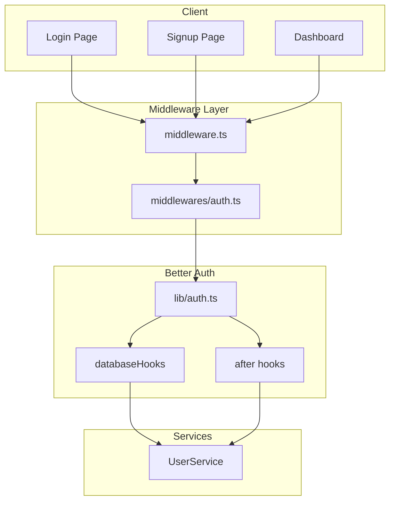
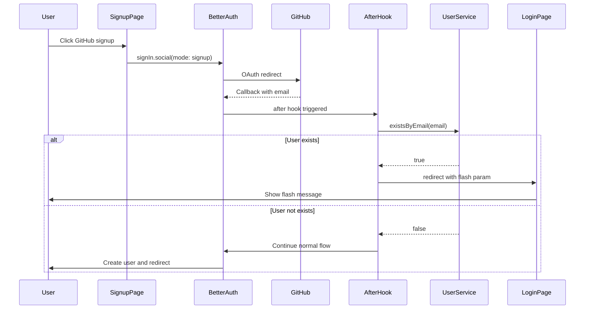
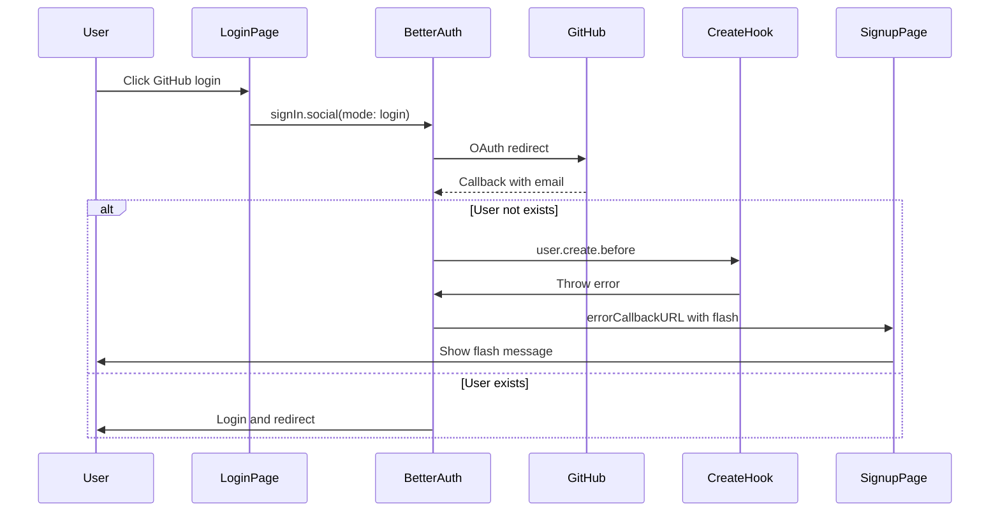
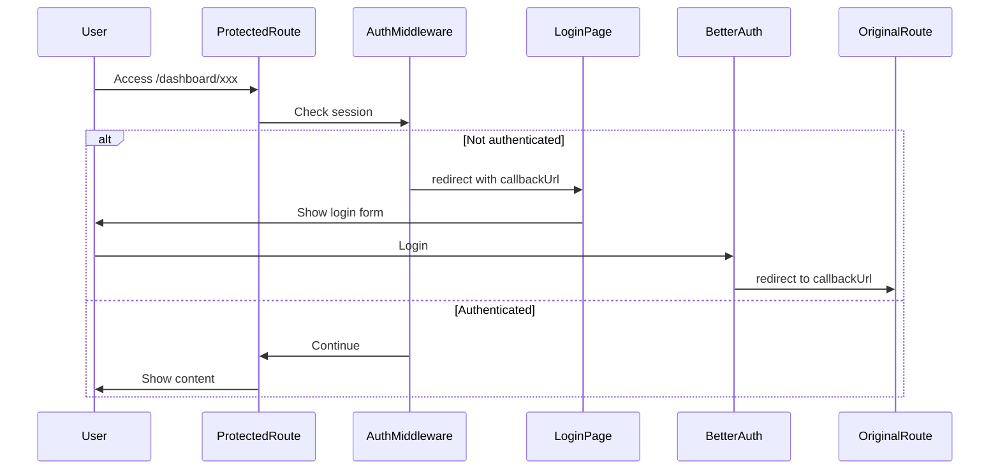

# Design Document: fix-auth-hook

## Overview

**Purpose**: 認証フロー全体の動作を改善し、ユーザー体験を向上させる。ルートエンドポイントでの自動リダイレクト、新規登録/ログイン画面での重複アカウント・未登録アカウント検出、および保護ルートへの未認証アクセス時のリダイレクト＆コールバック機能を提供する。

**Users**: 全ユーザー（認証済み・未認証）が対象。ログイン・新規登録・ダッシュボードアクセスのフローで利用。

**Impact**: 既存の Better Auth 設定に hooks を追加し、新規の認証ミドルウェアを導入。既存のレイアウトファイルでの個別セッションチェックは維持。

### Goals
- 認証状態に応じたルートエンドポイントの自動リダイレクト
- GitHub OAuth でのユーザー存在チェックとフラッシュメッセージ表示
- 保護ルートへの未認証アクセス時のログインリダイレクト＆コールバック
- 既存の Magic Link ユーザー存在チェック機能の維持

### Non-Goals
- Magic Link のユーザー存在チェック改修（既に実装済み）
- アカウントリンク機能の有効化
- メール送信機能（Resend 統合は別 Phase）

## Architecture

### Existing Architecture Analysis

現在の認証アーキテクチャ:
- **Better Auth** (`lib/auth.ts`): GitHub OAuth + Magic Link 設定済み
- **セッションチェック**: 各レイアウトファイル（dashboard/setting）で個別実装
- **フラッシュメッセージ**: `lib/flash-toaster.tsx` で Cookie ベース実装
- **ミドルウェア**: `middlewares/stackMiddleware.ts` でファクトリパターン実装済み、ルート `middleware.ts` は未作成

### Architecture Pattern & Boundary Map



**Architecture Integration**:
- Selected pattern: Middleware + Better Auth Hooks（既存パターンの拡張）
- Domain boundaries: 認証制御はミドルウェア層、ビジネスロジックは Better Auth hooks
- Existing patterns preserved: stackMiddleware、Effect-TS サービスパターン
- New components rationale: auth ミドルウェアは認証制御の一元化のため
- Steering compliance: TypeScript strict mode、Effect-TS サービスパターン準拠

### Technology Stack

| Layer | Choice / Version | Role in Feature | Notes |
|-------|------------------|-----------------|-------|
| Middleware | Next.js Middleware (Edge) | 認証状態チェック、リダイレクト | Edge Runtime 制限あり |
| Auth | Better Auth | OAuth hooks、セッション管理 | hooks API 使用 |
| Services | Effect-TS | ユーザー存在チェック | 既存 UserService 活用 |
| Flash | Cookie + Sonner | フラッシュメッセージ表示 | 既存実装活用 |

## System Flows

### GitHub OAuth 新規登録フロー（Req 3）



### GitHub OAuth ログインフロー（Req 5）



### 保護ルートアクセスフロー（Req 6）



## Requirements Traceability

| Requirement | Summary | Components | Interfaces | Flows |
|-------------|---------|------------|------------|-------|
| 1.1 | 認証済み→/dashboard | AuthMiddleware | - | - |
| 1.2 | 未認証→/login | AuthMiddleware | - | - |
| 2.1 | 新規登録 Magic Link 既存チェック | (既存実装) | - | - |
| 2.2 | 新規登録 Magic Link 正常フロー | (既存実装) | - | - |
| 3.1 | 新規登録 GitHub 既存チェック | AfterHook, GithubAuthSignupForm | OAuthState | GitHub OAuth 新規登録 |
| 3.2 | 新規登録 GitHub 正常フロー | (Better Auth default) | - | - |
| 4.1 | ログイン Magic Link 未登録チェック | (既存実装) | - | - |
| 4.2 | ログイン Magic Link 正常フロー | (既存実装) | - | - |
| 5.1 | ログイン GitHub 未登録チェック | DatabaseHooks, GithubAuthForm | OAuthState | GitHub OAuth ログイン |
| 5.2 | ログイン GitHub 正常フロー | (Better Auth default) | - | - |
| 6.1 | 未認証アクセス→/login + callback | AuthMiddleware | - | 保護ルートアクセス |
| 6.2 | ログイン成功→callback URL | (既存実装 useRedirectPath) | - | - |
| 6.3 | ログイン成功→/dashboard | (既存実装 useRedirectPath) | - | - |
| 6.4 | パブリックルート定義 | AuthMiddleware | PublicRoutes | - |

## Components and Interfaces

| Component | Domain/Layer | Intent | Req Coverage | Key Dependencies | Contracts |
|-----------|--------------|--------|--------------|------------------|-----------|
| AuthMiddleware | Middleware | 認証状態に応じたリダイレクト | 1.1, 1.2, 6.1, 6.4 | Better Auth (P0) | - |
| AuthHooks | Auth | GitHub OAuth ユーザー存在チェック | 3.1, 5.1 | UserService (P0) | Service |
| GithubAuthForm | UI | ログイン用 GitHub ボタン（mode 追加） | 5.1 | authClient (P0) | - |
| GithubAuthSignupForm | UI | 新規登録用 GitHub ボタン（mode 追加） | 3.1 | authClient (P0) | - |
| FlashHandler | UI | クエリパラメータからフラッシュ表示 | 3.1, 5.1 | useSearchParams (P1) | - |

### Middleware Layer

#### AuthMiddleware

| Field | Detail |
|-------|--------|
| Intent | ルートエンドポイントと保護ルートの認証制御 |
| Requirements | 1.1, 1.2, 6.1, 6.4 |

**Responsibilities & Constraints**
- ルートエンドポイント（/）での認証状態チェックとリダイレクト
- 保護ルートへの未認証アクセス時の /login リダイレクト（callbackUrl 付与）
- パブリックルート（/login, /signup, /api/auth/*）のバイパス
- Edge Runtime 制限: Drizzle 直接使用不可、Better Auth session API 使用

**Dependencies**
- Inbound: Next.js Middleware runtime (P0)
- External: Better Auth session API (P0)

**Contracts**: Service [x]

##### Service Interface
```typescript
// middlewares/auth.ts
import { MiddlewareFactory } from "./types";

const PUBLIC_ROUTES = ["/login", "/signup", "/api/auth"];

export const authMiddleware: MiddlewareFactory;
```
- Preconditions: リクエストが Next.js middleware で処理される
- Postconditions: 認証状態に応じたリダイレクトまたは NextResponse.next()
- Invariants: PUBLIC_ROUTES は認証チェックをスキップ

**Implementation Notes**
- Integration: `middleware.ts` で `stackMiddleware([authMiddleware])` として統合
- Validation: セッション Cookie の存在チェック（Edge Runtime 対応）
- Risks: Edge Runtime での Better Auth API 呼び出し制限

### Auth Layer

#### AuthHooks

| Field | Detail |
|-------|--------|
| Intent | GitHub OAuth コールバック時のユーザー存在チェック |
| Requirements | 3.1, 5.1 |

**Responsibilities & Constraints**
- OAuth state から `mode` を取得
- `mode: 'login'` 時: ユーザーが存在しない場合は作成を防止
- `mode: 'signup'` 時: ユーザーが既に存在する場合はリダイレクト
- フラッシュメッセージはクエリパラメータ経由で伝達

**Dependencies**
- Inbound: Better Auth hooks runtime (P0)
- External: UserService.existsByEmail (P0)

**Contracts**: Service [x]

##### Service Interface
```typescript
// lib/auth.ts への追加
import { betterAuth } from "better-auth";
import { getOAuthState } from "better-auth/api";

interface OAuthStateData {
  mode?: "login" | "signup";
}

export const auth = betterAuth({
  // ... existing config

  databaseHooks: {
    user: {
      create: {
        before: async (user, ctx) => {
          // ログインモードで新規ユーザー作成を防止
        },
      },
    },
  },

  hooks: {
    after: [
      {
        matcher: (ctx) => ctx.path.startsWith("/callback/"),
        handler: async (ctx) => {
          // サインアップモードで既存ユーザーをリダイレクト
        },
      },
    ],
  },
});
```
- Preconditions: OAuth コールバックが Better Auth で処理される
- Postconditions: ユーザー存在状態に応じた処理（作成/リダイレクト/エラー）
- Invariants: `mode` は `login` または `signup` のみ許可

**Implementation Notes**
- Integration: 既存の `lib/auth.ts` に hooks を追加
- Validation: OAuth state の `mode` を厳密に検証
- Risks: `getOAuthState` の戻り値が undefined の場合のハンドリング

### UI Layer

#### GithubAuthForm (修正)

| Field | Detail |
|-------|--------|
| Intent | ログイン画面用 GitHub ボタン（mode: login を追加） |
| Requirements | 5.1 |

**Contracts**: State [x]

##### State Management
```typescript
// app/ui/github-auth-form.tsx への修正
authClient.signIn.social({
  provider: "github",
  callbackURL: redirectPath,
  errorCallbackURL: "/signup?flash=not_registered",
  additionalData: { mode: "login" },
});
```

**Implementation Notes**
- Integration: 既存コンポーネントへの `additionalData` 追加のみ
- Validation: -
- Risks: -

#### GithubAuthSignupForm (修正)

| Field | Detail |
|-------|--------|
| Intent | 新規登録画面用 GitHub ボタン（mode: signup を追加） |
| Requirements | 3.1 |

**Contracts**: State [x]

##### State Management
```typescript
// app/ui/github-auth-signup-form.tsx への修正
authClient.signIn.social({
  provider: "github",
  callbackURL: redirectPath,
  newUserCallbackURL: redirectPath,
  errorCallbackURL: "/signup?flash=signup_failed",
  additionalData: { mode: "signup" },
});
```

**Implementation Notes**
- Integration: 既存コンポーネントへの `additionalData` 追加のみ

#### FlashHandler

| Field | Detail |
|-------|--------|
| Intent | クエリパラメータからフラッシュメッセージを表示 |
| Requirements | 3.1, 5.1 |

**Responsibilities & Constraints**
- URL クエリパラメータ `flash` を検出
- 対応するフラッシュメッセージを表示
- 表示後に URL からパラメータを削除

**Contracts**: State [x]

##### State Management
```typescript
// app/lib/hooks/useFlashFromQuery.ts (新規)
import { useSearchParams, useRouter } from "next/navigation";
import { useEffect } from "react";
import { toast } from "sonner";

const FLASH_MESSAGES: Record<string, { type: "success" | "error"; message: string }> = {
  account_exists: { type: "error", message: "アカウントが既に存在します。ログインしてください。" },
  not_registered: { type: "error", message: "アカウントが存在しません。新規登録してください。" },
};

export function useFlashFromQuery(): void;
```

**Implementation Notes**
- Integration: LoginForm, SignUpForm で呼び出し
- Validation: 定義済みの flash キーのみ処理
- Risks: URL 直接編集による意図しないフラッシュ表示（低リスク）

## Error Handling

### Error Strategy
- Better Auth hooks でのエラー: `errorCallbackURL` にリダイレクト
- ミドルウェアでのエラー: ログ出力後、通常フローで継続（フェイルセーフ）

### Error Categories and Responses
**User Errors (4xx)**:
- 未登録アカウントでログイン試行 → `/signup?flash=not_registered` にリダイレクト
- 既存アカウントで新規登録試行 → `/login?flash=account_exists` にリダイレクト

**System Errors (5xx)**:
- OAuth state 取得失敗 → 通常フローで継続（ログ出力）
- UserService エラー → エラーページにリダイレクト

## Testing Strategy

### Unit Tests
- `authMiddleware`: パブリックルート判定、callbackUrl 生成
- `useFlashFromQuery`: flash パラメータ検出、メッセージマッピング

### Integration Tests
- Better Auth hooks: mode によるユーザー作成可否
- ミドルウェア + Better Auth: 認証フロー全体

### E2E Tests
- GitHub OAuth 新規登録（既存ユーザーあり/なし）
- GitHub OAuth ログイン（既存ユーザーあり/なし）
- 保護ルートへの未認証アクセス → ログイン → コールバック
