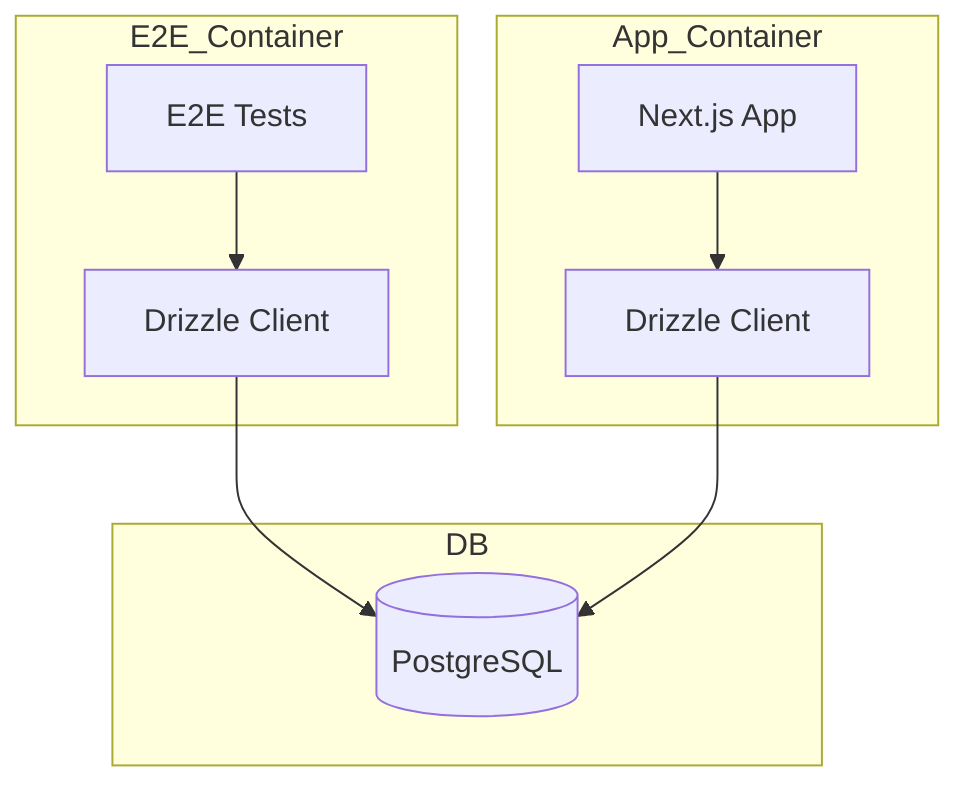
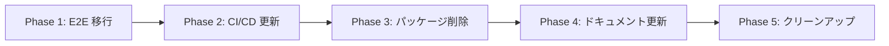

# Technical Design: remove-prisma

## Overview

**Purpose**: プロジェクトから Prisma パッケージおよび関連設定を完全に削除し、Drizzle ORM への移行を完了する。

**Users**: 開発者が Prisma 依存のない統一された ORM 環境で開発できるようになる。

**Impact**: E2E テスト環境、CI/CD パイプライン、Docker 構成、ドキュメントから Prisma 関連の記述を削除。

### Goals
- Prisma パッケージ依存の完全削除
- E2E テストを Drizzle ORM で動作させる
- CI/CD パイプラインを Drizzle Kit に統一
- ドキュメントを最新の状態に更新

### Non-Goals
- 本番 DB の `_prisma_migrations` テーブル削除（別タスクで対応）
- 新規 Drizzle マイグレーションの作成

## Architecture

### Existing Architecture Analysis

現在の状態:
- **ORM**: Drizzle ORM（メインアプリケーション）、Prisma（E2E テストのみ）
- **マイグレーション**: Drizzle Kit（drizzle/）
- **DB クライアント**: db/drizzle/client.ts

Prisma 残存箇所:
- e2e/tests/utils/signIn.ts（Prisma Client 使用）
- e2e/package.json（@prisma/client 依存）
- e2e/Dockerfile（prisma generate 実行）
- docker-compose.e2e.yml（prisma migrate deploy 実行）
- .github/workflows/prisma-migrate-deploy.yml（CI/CD）

### Architecture Pattern & Boundary Map



**Architecture Integration**:
- Selected pattern: 既存の Drizzle パターンを E2E に拡張
- Domain/feature boundaries: E2E は独立したコンテナで動作
- Existing patterns preserved: db/drizzle/ の構造を維持
- New components rationale: E2E 用の Drizzle 設定を追加
- Steering compliance: tech.md の ORM 標準（Drizzle）に準拠

### Technology Stack

| Layer | Choice / Version | Role in Feature | Notes |
|-------|------------------|-----------------|-------|
| Data / Storage | Drizzle ORM 0.44+ | E2E テストデータ操作 | 既存設定を再利用 |
| Infrastructure | Drizzle Kit 0.31+ | マイグレーション適用 | prisma migrate deploy を置換 |

## Requirements Traceability

| Requirement | Summary | Components | Interfaces | Flows |
|-------------|---------|------------|------------|-------|
| 1.1 | signIn を Drizzle に移行 | E2E Drizzle Client | DrizzleDB | - |
| 1.2 | E2E から @prisma/client 削除 | e2e/package.json | - | - |
| 1.3 | Dockerfile から prisma 削除 | e2e/Dockerfile | - | - |
| 2.1 | CI/CD ワークフロー削除 | prisma-migrate-deploy.yml | - | - |
| 3.1 | Docker Compose 更新 | docker-compose.e2e.yml | - | - |
| 4.1-4.4 | パッケージ依存削除 | package.json, e2e/package.json | - | - |
| 5.1-5.2 | ドキュメント更新 | README.md, .claude/CLAUDE.md | - | - |
| 6.1-6.3 | 不要ファイル削除 | .gitignore, db/drizzle/schema.ts | - | - |
| 7.1 | prismaMigrations 削除 | db/drizzle/schema.ts | - | - |

## Components and Interfaces

| Component | Domain/Layer | Intent | Req Coverage | Key Dependencies | Contracts |
|-----------|--------------|--------|--------------|------------------|-----------|
| E2E Drizzle Client | E2E/Data | E2E テストでの DB 操作 | 1.1 | drizzle-orm (P0) | - |
| signIn.ts | E2E/Utils | テストユーザー作成 | 1.1 | E2E Drizzle Client (P0) | - |
| docker-compose.e2e.yml | Infra | E2E 環境構成 | 3.1, 3.2 | drizzle-kit (P0) | - |

### E2E Layer

#### E2E Drizzle Client

| Field | Detail |
|-------|--------|
| Intent | E2E テストで PostgreSQL にアクセスするための Drizzle クライアント |
| Requirements | 1.1 |

**Responsibilities & Constraints**
- E2E コンテナ内で PostgreSQL に接続
- 既存の db/drizzle/schema.ts を使用
- 環境変数 `DATABASE_URL` から接続情報を取得

**Dependencies**
- External: drizzle-orm — PostgreSQL 接続 (P0)
- External: pg — PostgreSQL ドライバ (P0)

**Contracts**: Service [ ]

**Implementation Notes**
- Integration: db/drizzle/ ディレクトリを E2E コンテナにコピー
- Validation: E2E テスト実行時に接続確認

#### signIn.ts 修正

| Field | Detail |
|-------|--------|
| Intent | E2E テスト用のユーザー作成・認証設定 |
| Requirements | 1.1 |

**Responsibilities & Constraints**
- Prisma Client を Drizzle に置換
- 既存のテストユーザー作成ロジックを維持

**Dependencies**
- Inbound: E2E Tests — テスト実行時に呼び出し (P0)
- Outbound: E2E Drizzle Client — DB 操作 (P0)

**Before (Prisma)**:
```typescript
import { prisma } from "@/prisma";

await prisma.user.count({ where: { email: "user@example.com" } });
await prisma.user.create({ data: {...} });
```

**After (Drizzle)**:
```typescript
import { db } from "./db";
import { user } from "./schema";
import { eq } from "drizzle-orm";

const count = await db.select().from(user).where(eq(user.email, "user@example.com"));
await db.insert(user).values({...});
```

**Implementation Notes**
- Integration: Drizzle の select/insert API を使用
- Validation: テストユーザーが正しく作成されることを確認

## Data Models

### 影響なし

既存の db/drizzle/schema.ts をそのまま使用。

変更点:
- `prismaMigrations` テーブル定義を削除（コード上のみ、DB テーブルは維持）

## Error Handling

### Error Strategy

E2E テストの DB 接続エラー時は即座に失敗させる（テスト環境のため graceful degradation は不要）。

### Error Categories and Responses

**System Errors**:
- DB 接続失敗 → テスト失敗、ログ出力
- マイグレーション失敗 → コンテナ起動失敗

## Testing Strategy

### E2E Tests
- signIn 関数を使用するテストが正常に動作すること
- テストユーザーが正しく作成されること

### Integration Tests
- `docker compose -f docker-compose.e2e.yml up --build` が成功すること
- マイグレーションが正常に完了すること

### Verification
- `bun install` 後に node_modules に @prisma/ パッケージがないこと
- `grep -r "prisma" --include="*.ts"` で Prisma 参照がないこと（node_modules 除外）

## Migration Strategy



### Phase 1: E2E 移行
1. e2e/ に Drizzle クライアント・スキーマをコピー
2. signIn.ts を Drizzle に書き換え
3. E2E テスト実行確認

### Phase 2: CI/CD 更新
1. prisma-migrate-deploy.yml を削除
2. docker-compose.e2e.yml を Drizzle Kit コマンドに更新

### Phase 3: パッケージ削除
1. e2e/package.json から @prisma/client 削除
2. e2e/Dockerfile から prisma 関連削除
3. `npm --prefix ./e2e install ./e2e` 実行

### Phase 4: ドキュメント更新
1. README.md から Prisma コマンド削除
2. .claude/CLAUDE.md から Prisma 参照削除

### Phase 5: クリーンアップ
1. .gitignore から /prisma/seeds 削除
2. db/drizzle/schema.ts から prismaMigrations 削除
3. bun install で yarn.lock を更新

### Rollback Triggers
- E2E テスト失敗時は Phase 1 をロールバック
- CI/CD 失敗時は Phase 2 をロールバック
