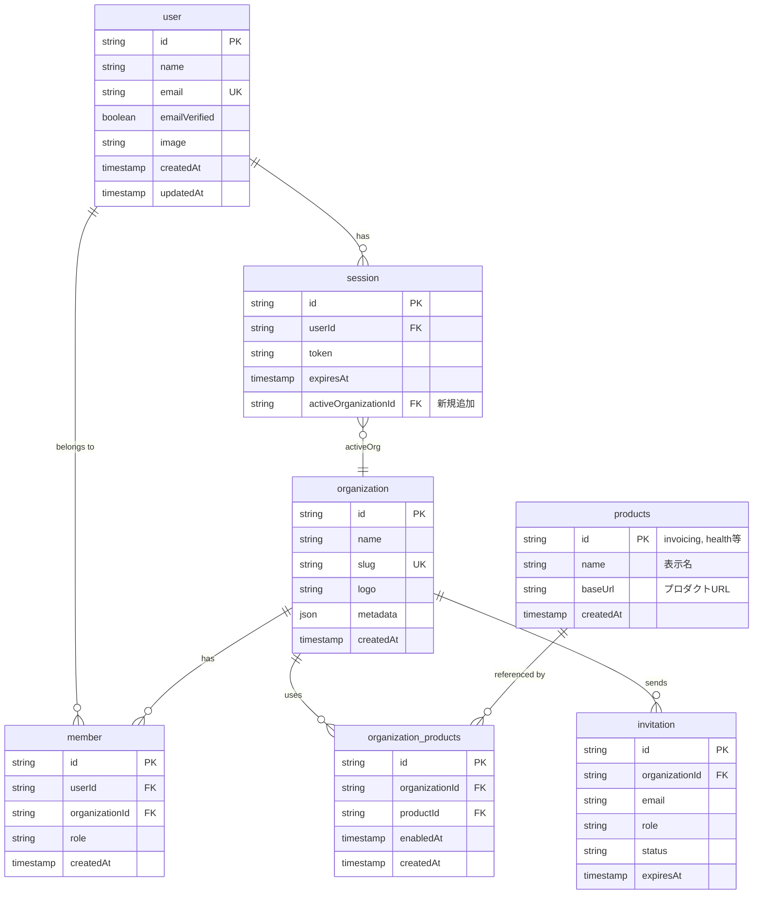
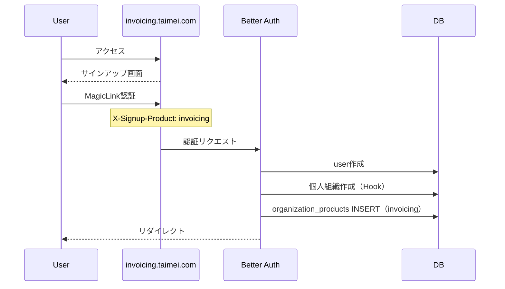
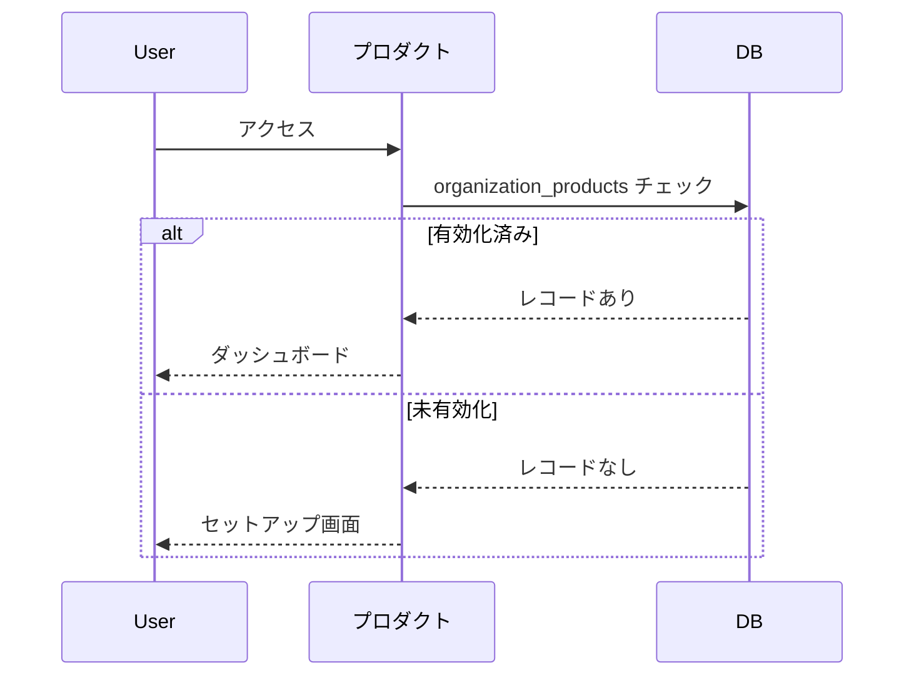

# マルチプロダクト組織モデル設計（改訂版）

## 概要

マルチプロダクト戦略に向けた組織モデルの追加。ユーザーが複数組織に所属し、組織が複数プロダクトを利用できる構造を実現。

## 設計方針（4人の議論結果）

### 分散型設計を採用

```
┌─────────────────────────────────────────────────────────────┐
│                   中央（taimei-core）                        │
├─────────────────────────────────────────────────────────────┤
│  知っていること:                                             │
│  - どの組織がどのプロダクトを使っているか（有効化状態）       │
│  - プロダクトの登録情報（ID、名前、URL）                     │
│                                                             │
│  知らないこと:                                               │
│  - 各プロダクトのプラン詳細（課金システムが管理）            │
│  - 各プロダクトのロール詳細（各プロダクトが管理）            │
└─────────────────────────────────────────────────────────────┘
```

### 削除するもの（YAGNI）

| 元のプラン | 削除理由 |
|-----------|---------|
| `plan` カラム | 課金システム（Stripe等）導入時に追加 |
| `organization_product_members` テーブル | プロダクトごとのアクセス制御不要 |
| `app/config/products.ts` | products テーブルで管理 |
| `PRODUCT_PLANS`, `PRODUCT_ROLES` 定義 | 各プロダクトが自己管理 |

## ER図（シンプル化）



※ `organization_product_members` は削除（組織メンバー = 全プロダクトアクセス可）

## 確定要件

| 項目 | 決定事項 |
|------|---------|
| プロダクト管理 | `products` テーブルで管理（マイグレーションでseed） |
| プラン管理 | 今回対象外。課金システム導入時に追加 |
| ロール管理 | 組織レベルのみ（Better Auth標準）。プロダクトごとのロールなし |
| アクセス制御 | 組織メンバー = 全プロダクトアクセス可 |
| 表示出し分け | `organization_products` で有効化状態を確認 |

## 実装計画（3PR）

### PR1: スキーマ定義 + Better Auth Organization プラグイン

**変更ファイル:**
- `db/drizzle/schema.ts` - products, organization_products テーブル追加
- `drizzle/` - マイグレーションSQL（初期データ含む）
- `lib/auth.ts` - organization プラグイン追加
- `lib/auth-client.ts` - organizationClient プラグイン追加

**スキーマ:**
```typescript
// db/drizzle/schema.ts
export const products = pgTable("products", {
  id: text("id").primaryKey(),
  name: text("name").notNull(),
  baseUrl: text("base_url").notNull(),
  createdAt: timestamp("created_at").defaultNow().notNull(),
});

export const organizationProducts = pgTable(
  "organization_products",
  {
    id: text("id").primaryKey(),
    organizationId: text("organization_id")
      .notNull()
      .references(() => organization.id, { onDelete: "cascade" }),
    productId: text("product_id")
      .notNull()
      .references(() => products.id),
    enabledAt: timestamp("enabled_at").defaultNow().notNull(),
    createdAt: timestamp("created_at").defaultNow().notNull(),
  },
  (table) => [
    uniqueIndex("org_product_unique").on(table.organizationId, table.productId),
  ],
);
```

**初期データ（マイグレーション内）:**
```sql
INSERT INTO products (id, name, base_url, created_at) VALUES
  ('invoicing', '請求書管理', 'https://invoicing.taimei.com', NOW()),
  ('health', '健康管理', 'https://health.taimei.com', NOW());
```

**Better Auth設定:**
```typescript
// lib/auth.ts
import { organization } from "better-auth/plugins";

export const auth = betterAuth({
  plugins: [
    organization({
      allowUserToCreateOrganization: async () => true,
      organizationLimit: 10,
      membershipLimit: 100,
    }),
  ],
});
```

---

### PR2: 個人組織自動作成 Hook + OrganizationProductService

**変更ファイル:**
- `lib/auth/hooks/personal-org-hook.ts` - 新規
- `lib/auth.ts` - Hook統合
- `app/services/organization-product-service.ts` - 新規
- `app/services/organization-product-errors.ts` - 新規
- `app/services/index.ts` - Layer統合
- `app/services/__tests__/organization-product-service.test.ts` - 新規

**個人組織作成Hook:**
```typescript
// lib/auth/hooks/personal-org-hook.ts
export async function createPersonalOrganization({
  user,
  signupProductId,
}: {
  user: User;
  signupProductId: string;
}) {
  // 1. 個人組織を作成（Better Auth API）
  const org = await auth.api.createOrganization({
    body: {
      name: `${user.name || user.email}のワークスペース`,
      slug: `personal-${user.id}`,
      metadata: { personal: true },
    },
  });

  // 2. サインアップ元プロダクトを有効化
  await runService(() =>
    Effect.gen(function* () {
      const service = yield* OrganizationProductService;
      yield* service.enableProduct({
        organizationId: org.id,
        productId: signupProductId,
      });
    })
  );

  return org;
}
```

**OrganizationProductService:**
```typescript
// app/services/organization-product-service.ts
export class OrganizationProductService extends Effect.Service<OrganizationProductService>()(
  "services/OrganizationProductService",
  {
    effect: Effect.gen(function* () {
      const pgdrizzle = yield* PgDrizzle.PgDrizzle;
      const idGen = yield* IdGenerator;

      return {
        enableProduct: (input: { organizationId: string; productId: string }) =>
          Effect.gen(function* () {
            const id = yield* idGen.generate;
            yield* Effect.tryPromise({
              try: () =>
                pgdrizzle.insert(organizationProducts).values({
                  id,
                  organizationId: input.organizationId,
                  productId: input.productId,
                }),
              catch: (e) =>
                new OrganizationProductServiceError({ message: `insert failed: ${e}` }),
            });
            return { id };
          }),

        hasAccess: (organizationId: string, productId: string) =>
          Effect.tryPromise({
            try: () =>
              pgdrizzle
                .select()
                .from(organizationProducts)
                .where(
                  and(
                    eq(organizationProducts.organizationId, organizationId),
                    eq(organizationProducts.productId, productId),
                  ),
                )
                .then((r) => r.length > 0),
            catch: (e) =>
              new OrganizationProductServiceError({ message: `check failed: ${e}` }),
          }),

        listByOrganization: (organizationId: string) =>
          Effect.tryPromise({
            try: () =>
              pgdrizzle
                .select()
                .from(organizationProducts)
                .where(eq(organizationProducts.organizationId, organizationId)),
            catch: (e) =>
              new OrganizationProductServiceError({ message: `list failed: ${e}` }),
          }),
      } as const;
    }),
  },
) {}
```

---

### PR3: Server Actions + UI

**変更ファイル:**
- `app/lib/actions.ts` - enableProductAction 追加
- `app/lib/data.ts` - getOrganizationProducts 追加
- `app/(pages)/setting/products/page.tsx` - 新規
- `app/ui/settings/product-settings.tsx` - 新規

**Server Action:**
```typescript
// app/lib/actions.ts
export async function enableProductAction(
  organizationId: string,
  productId: string,
) {
  const result = await runService(() =>
    Effect.gen(function* () {
      const service = yield* OrganizationProductService;
      return yield* service.enableProduct({ organizationId, productId });
    })
  );

  if (Either.isLeft(result)) {
    return { error: "プロダクトの有効化に失敗しました" };
  }

  await setFlash({ type: "success", message: "プロダクトを有効化しました" });
  redirect("/dashboard");
}
```

**データ取得:**
```typescript
// app/lib/data.ts
import { cache } from "react";

export const getOrganizationProducts = cache(async (organizationId: string) => {
  const result = await runService(() =>
    Effect.gen(function* () {
      const service = yield* OrganizationProductService;
      return yield* service.listByOrganization(organizationId);
    })
  );
  return Either.isRight(result) ? result.right : [];
});
```

---

## 主要フロー

### 新規登録フロー



### 表示出し分けフロー



---

## 検証方法

1. **PR1**: `bunx drizzle-kit migrate` → 型チェック（`bun tsc --noEmit`）→ products テーブルに初期データ確認
2. **PR2**: `bun run test:db` で Service テスト → 手動でOAuth登録→個人組織作成確認
3. **PR3**: 開発環境でプロダクト有効化操作を確認

---

## M&A拡張性

```
M&A時の追加手順:
1. products テーブルに新プロダクト INSERT
2. 買収プロダクトの認証を Better Auth に置き換え
3. 買収プロダクトに organization_products チェック追加

本体コード変更: 不要
```
